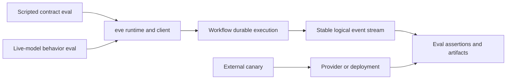

# E2E fixture reliability

## Summary

The fixture-owned e2e suite has caught real eve regressions, especially in HITL
resume behavior, but its current failures combine four different signals:

1. deterministic eve or Workflow correctness failures;
2. incomplete or ambiguous stream transport;
3. model behavior against an unnecessarily brittle fixture contract; and
4. external provider, search, deployment, or credential availability.

This audit covers every local and Vercel e2e workflow run from the suite's
introduction on June 16, 2026 through July 14, 2026. The strongest flake signal
is a failed workflow attempt followed by a successful attempt for the same run
ID and commit SHA. That avoids treating known regressions, cancelled runs, fork
approval, and superseded commits as flake.

There were 234 failed fixture job-attempts inside workflows that later passed
at the same SHA: 81 local and 153 Vercel. One missing-credential incident caused
22 of those failures across both workflows. The remaining 212 are high-confidence
same-code flakes. They are not adequately explained by model nondeterminism.
Deterministic stress tests lose turn boundaries, Workflow-backed runs duplicate
events, structured-turn failures can be reported as success, partial provider
streams can be accepted as completed turns, and `onSession` side effects can be
repeated.

The suite should separate deterministic contract tests, live-model behavior
tests, and external-service canaries. eve also needs stronger completion,
identity, lifecycle, and diagnostic contracts so an eval can identify which
layer failed without inferring it from model output.

## Audit baseline

Both e2e workflows discover the same 16 current fixture packages and 76 eval
files. Seventy-four evals use live models. Only the two `agent-workflow-stress`
evals use a deterministic mock model, and only three evals use judges. A fixture
runs its eval files with concurrency eight by default, while each
fixture/provider pair is an independent CI matrix job with its own build and
deployment lifecycle.

[PR #779](https://github.com/vercel/eve/pull/779), merged after the audited run
window, expanded both workflows across OpenAI and Anthropic models. The current
matrix therefore contains 32 fixture/provider jobs per workflow. The historical
counts below predate that expansion and cannot be segmented by provider; the
new dimension makes typed failure ownership and provider-specific stability
reporting more urgent.

The following counts are failed matrix job-attempts that later passed at the
identical SHA. A job can contain more than one failed eval, so these numbers are
evidence of instability rather than an eval-level failure rate. They include
the 22-job credential incident, which is removed from the 212 total used for
causal analysis.

| Fixture                   | Local | Vercel | Principal observed failure area                         |
| ------------------------- | ----: | -----: | ------------------------------------------------------- |
| `agent-tools`             |    45 |     40 | Live search, tool cardinality, narration, dynamic tools |
| `agent-subagents`         |     5 |     39 | Duplicated Workflow events, recursive visibility        |
| `agent-tools-hitl`        |     4 |     23 | Resume/regate history and unrelated queued input        |
| `agent-tools-sandbox`     |     2 |     14 | Replayed session setup and redeploy skill selection     |
| `agent-basic-runtime`     |     9 |     13 | Structured output and schema isolation                  |
| `agent-workflow-stress`   |     0 |     13 | Missing turn boundary under deterministic load          |
| `agent-skills`            |     5 |      2 | Dynamic and qualified skill selection                   |
| `agent-subagents-hitl`    |     5 |      3 | Stream disconnect during nested HITL resume             |
| `agent-channels`          |     2 |      3 | Channel delivery behavior                               |
| `agent-openapi`           |     1 |      1 | OpenAPI tool behavior                                   |
| `agent-schedules`         |     1 |      1 | Schedule behavior                                       |
| `extensions`              |     1 |      0 | Partial model stream after dynamic skill load           |
| `agent-model`             |     0 |      0 | No same-SHA flake observed                              |
| `agent-prompt-cache`      |     0 |      0 | No same-SHA flake observed                              |
| `agent-session-limits`    |     0 |      0 | No same-SHA flake observed                              |
| `agent-tools-hitl-openai` |     0 |      0 | No same-SHA flake observed                              |
| Legacy weather fixture    |     1 |      1 | Removed from the current matrix                         |

Recent failures are concentrated rather than uniformly random. From July 8
through July 14, same-SHA failures included 27 live web-search observations, 12
Vercel dynamic-workflow observations, eight recursive-root-only observations,
seven redeploy observations, seven unrelated-input HITL observations, five
deterministic stress observations, and smaller clusters around structured
output, narration ordering, sandbox persistence, and dynamic skills.

Earlier clusters around HITL approval history, dynamic-tool overwrite, and
parallel-call cardinality produced or motivated real fixes. Historical counts
therefore should not be read as the current failure distribution. They do show
that rerunning an e2e job has repeatedly hidden actionable product defects.

## Findings

### Workflow event publication is not replay-safe

The `agent-subagents/dynamic-workflow` artifact from
[run 29116211530](https://github.com/vercel/eve/actions/runs/29116211530)
contains four `subagent.completed` events for two subagents. Each logical event
and its corresponding `action.result` appears twice with the same call ID and
output. The model completed the requested work correctly.

eve emits completion events before returning the durable state that clears the
pending action batch. Workflow documents an ambiguous window in which a step
completion can be executed again after a failed acknowledgement, while its
stream appends are non-idempotent. Event publication and the durable state
transition therefore are not atomic. A stable logical event ID plus idempotent
append or consumer deduplication is required. The unmerged
[PR #358](https://github.com/vercel/eve/pull/358) proposed part of this boundary;
the fixture demonstrates that the underlying issue remains.

Externally observable contract:

- every logical eve event has an ID that remains stable across Workflow replay;
- replay cannot expose the same logical event twice to clients or evals; and
- artifacts retain replay-attempt metadata separately from logical events.

### A missing turn boundary is currently reported as success

`agent-workflow-stress` is deterministic. In
[run 29284192812](https://github.com/vercel/eve/actions/runs/29284192812), 50
sessions each sent two turns, but one session produced only its first turn. The
client exhausted stream reconnects, returned no second message, and the eval
failed later at an unlabeled equality assertion.

`MessageResponse.result` derives `completed` when it sees no terminal boundary.
The stream reader also exits silently when its reconnect budget is exhausted.
Together these turn an incomplete stream into an empty successful response.
This is an eve client correctness bug, not model variance. The closed
[PR #369](https://github.com/vercel/eve/pull/369) explored idle reconnect and a
missing-boundary error, but the current contract still permits silent success.

Externally observable contract:

- a response has a result only after a terminal turn or session boundary;
- clean EOF, idle exhaustion, or reconnect exhaustion before that boundary
  throws a typed `STREAM_ENDED_BEFORE_TURN_BOUNDARY` error; and
- the error includes session ID, starting index, reconnect count, and the last
  observed event.

### Turn status and structured-output lifetime are incorrect

In [run 29276519336](https://github.com/vercel/eve/actions/runs/29276519336),
the first structured turn emitted `step.failed` and `turn.failed` with
`OUTPUT_SCHEMA_NOT_FULFILLED`. It then emitted `session.waiting`, so
`expectOk()` passed because eval status was derived only from the session
boundary. The next plain turn inherited the failed turn's output schema and
was forced to return a structured result.

This exposes two eve bugs:

- an unrecovered `step.failed` or `turn.failed` in the evaluated turn must make
  that turn fail even when the session subsequently waits; and
- a fresh plain turn must clear a previous run-scoped output schema, while an
  actual continuation such as HITL resume must preserve it.

The regression test must cover a failed structured turn followed by a plain
turn; a successful structured turn alone does not exercise the leak.

### Partial provider streams can complete successfully

In [run 29337020261](https://github.com/vercel/eve/actions/runs/29337020261),
`load_skill` succeeded and the following model response stopped after “I loaded
the skill as”. The provider stream ended with finish reason `other`, no usage,
and no provider metadata. eve emitted `turn.completed` and `session.waiting`;
only a later output assertion detected the truncation.

A terminal model step needs a completion-integrity check. A partial response
ending with `other` and missing completion metadata should fail with a typed
`MODEL_STREAM_INCOMPLETE` error, or receive one explicitly bounded retry, unless
the provider adapter can prove that the finish state is terminal. A fully empty
stream check is insufficient.

### `onSession` cannot promise an unqualified once-only side effect

The sandbox persistence eval in
[run 29284880762](https://github.com/vercel/eve/actions/runs/29284880762) failed
because its session setup tried to bind fixed port 43100 more than once. Every
subsequent bash action failed. The fixture starts the server from `onSession`,
which eve describes as running once per session.

The initialized bit is persisted only after the callback completes. Workflow
replay can therefore rerun the callback from stale state. Arbitrary external
side effects cannot have exactly-once semantics across an ambiguous process
failure. eve should instead guarantee serialized setup, document retry after
ambiguous failure, pass a stable idempotency key, and provide an eve-managed
primitive for setup that can be safely claimed or resumed. The fixture should
also use an idempotent PID/health check and a session-specific port rather than
relying on the current promise.

### Several model flakes are avoidable contract-design failures

These failures involve a model, but each has a more specific cause and fix:

- The web-search prompt asked who won the 2026 NBA Finals while the model
  believed the event was still in the future. A later prompt change explicitly
  establishes the date and requires search. Separately,
  [run 29256559672](https://github.com/vercel/eve/actions/runs/29256559672)
  records a real 60-second search-tool timeout. Runtime ordering should be
  tested with a scripted tool; live search availability should be a canary.
- The redeploy eval repeatedly passed `deploy note` to `load_skill` instead of
  the canonical `deploy-note`. The effective authored and dynamic skill names
  are finite at invocation time, so `load_skill` should expose them as a schema
  enum instead of accepting an unconstrained string. The deployment-pinning
  concern in [issue #582](https://github.com/vercel/eve/issues/582) is separate.
- The recursive-root-only fixture can observe only the parent event stream. A
  child saying that it saw the recursive tool does not prove whether lineage
  was lost or the model fabricated the report. Eval artifacts need the child
  session tree, and the runtime contract should use a scripted model that
  responds from the actual advertised tool set.
- The authored-always-unrelated-input fixture approved its original action,
  then its queued “unrelated” note induced a new `ask_question` request. The
  target regression fixed by [PR #588](https://github.com/vercel/eve/pull/588)
  had already passed. The fixture should assert that the approved action is not
  gated again without also requiring the model never to request unrelated
  input. Eval diagnostics must count unresolved request IDs, not every
  historical `input.requested` event.

These changes do not weaken the suite. They make each failure falsify one
specific contract.

## Proposed eval model

Every eval should declare one reliability class:

| Class      | Purpose                                                       | Dependencies                                | CI interpretation                                       |
| ---------- | ------------------------------------------------------------- | ------------------------------------------- | ------------------------------------------------------- |
| `contract` | Prove eve state, event, tool, and resume semantics            | Scripted model and controlled tools         | Any failed attempt blocks                               |
| `behavior` | Prove a frontier model can use the authored surface           | Live model; controlled tools where possible | Multiple fresh attempts produce pass, fail, or unstable |
| `external` | Monitor provider, search, deployment, or sandbox availability | Live external service                       | Reported independently from product correctness         |

An attempt is never silently retried into a pass. For behavior evals, the
author may request multiple fresh-session attempts and a pass threshold. Mixed
outcomes are reported as `unstable`, with every attempt preserved. CI policy
may initially tolerate `unstable` behavior evals while still recording and
alerting on them; contract evals remain strict. External canaries should not be
the only proof of an eve protocol invariant.

A compact authoring shape is sufficient:

```ts
defineEval({
  reliability: {
    class: "behavior",
    attempts: 3,
    requiredPasses: 2,
  },
  run: async ({ session, t }) => {
    const turn = await session.send("...");
    turn.expectBoundary("waiting");
    t.check("final marker", turn.message, contains("EXPECTED_MARKER"));
  },
});
```

The exact names are not important; the observable semantics are:

- every attempt uses a fresh session unless the eval explicitly owns a
  multi-turn lifecycle;
- assertions record a label, actual value, expected predicate, and relevant
  event slice;
- `expectOk()` is scoped to the current turn and cannot pass an incomplete or
  failed turn;
- pending HITL diagnostics report currently unresolved request IDs;
- subagent artifacts include a navigable parent/child execution tree; and
- failure taxonomy distinguishes assertion, eve runtime, incomplete stream,
  model behavior, tool provider, deployment, and fixture setup.

The scripted model used by contract tests must be able to inspect advertised
tools, emit tool calls and content chunks, park on input, close without a
boundary, and inject provider errors. That lets the suite reproduce the active
failures without live-model ambiguity.

## Ownership boundary



An event or turn invariant must be established through the contract path. A
behavior eval then tests whether the public authoring surface is usable by a
frontier model. The canary path measures external availability without
reclassifying it as an eve semantic failure.

## Delivery plan

### 1. Make incomplete and replayed execution impossible to report as success

1. Require a terminal boundary from `MessageResponse.result` and add the typed
   missing-boundary error with reconnect diagnostics.
2. Derive eval turn status from turn-local failures as well as the terminal
   session boundary.
3. Validate model-stream completion and reject ambiguous partial completion.
4. Clear run-scoped output schema on a fresh plain turn and preserve it only
   for a true continuation.
5. Give every logical event a replay-stable ID and deduplicate replayed stream
   appends before exposing them to clients.

Each change needs a deterministic regression test before changing fixture
expectations.

### 2. Fix lifecycle and identifier contracts

1. Replace the once-only `onSession` claim with explicit serialized,
   retry-aware semantics and a stable idempotency key or managed setup API.
2. Make the sandbox setup fixture idempotent and remove its shared fixed-port
   assumption.
3. Constrain `load_skill` to the effective skill identifiers for the current
   node and retain unknown-name suggestions only as an error path.
4. Expose unresolved HITL requests and the subagent execution tree as
   first-class eval facts.

### 3. Split brittle fixtures into contract, behavior, and canary coverage

1. Convert stress, recursive-tool visibility, event ordering, tool cardinality,
   and HITL state-machine assertions to scripted contract tests.
2. Retain focused live-model behavior tests for the same authoring surfaces,
   but assert semantic outcomes instead of incidental wording or call shape.
3. Separate web-search and deployment availability from the runtime ordering
   assertions they currently gate.
4. Quote exact identifiers and establish time-sensitive facts in prompts when
   those facts are fixture preconditions.

### 4. Add stability-aware reporting and CI policy

1. Add reliability class, fresh attempts, thresholds, and the `unstable`
   verdict to `eve eval` and JUnit output.
2. Preserve per-attempt event artifacts and typed failure ownership.
3. Keep deterministic contract fixtures blocking on pull requests. Run live
   behavior fixtures with an explicit threshold and surface unstable outcomes.
4. Run external canaries separately and alert on their rolling availability;
   do not use a blanket job rerun as the primary recovery mechanism.
5. Build a same-SHA flake ledger from JUnit artifacts so fixture owners can see
   first-failure signatures, not only final workflow status.

## Success criteria

- Deterministic contract evals have no mixed outcomes across 500 repeated
  attempts under local and Vercel Workflow backends.
- No client response reports success without a terminal boundary, and no
  logical event is exposed twice after Workflow replay.
- Every failed assertion names the contract and records actual, expected, and
  the relevant event path.
- Every e2e failure is assigned to eve runtime, Workflow transport, model
  behavior, external service, or fixture setup without log archaeology.
- Live-model behavior stability is measured per eval over time; a mixed result
  is visible as unstable rather than converted to green by a workflow rerun.
- Credential and provider incidents are reported once at their owning layer
  instead of appearing as dozens of unrelated flaky fixtures.

## Non-goals

- Treating frontier-model nondeterminism as a sufficient root cause.
- Making the suite green through blanket retries, quarantine, or weaker
  assertions.
- Promising exactly-once arbitrary external side effects across process failure.
- Replacing fixture-owned e2e coverage with only unit or integration tests.
